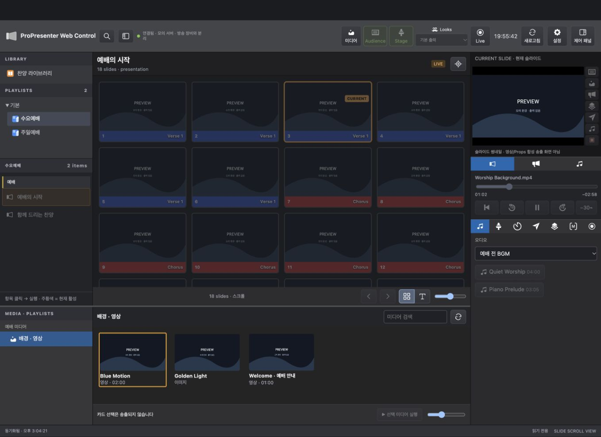

# ProPresenter Web Control

A single-file, bilingual (English / Korean) browser controller for a local ProPresenter instance. This is an independent community project, not an official Renewed Vision product. ProPresenter is a trademark of its respective owner.

## Getting started

**[Open the interactive demo](https://gurcks8989.github.io/Propresenter-Web-Control/)**

The demo runs entirely in your browser with synthetic sample data. It cannot connect to ProPresenter or control real equipment. Try slide navigation, library browsing, media selection and screen toggles. Advanced controls such as capture, macros and transport are illustrative and do not reproduce all device behavior. Reload to reset sample state. For real use, download `propresenter_control_v9.html` instead.

*Actual browser rendering of the controller with sample data from an isolated local mock server. Thumbnails are placeholders, not live production output. The interface supports both Korean and English.*

1. Open `propresenter_control_v9.html` in a modern browser.
2. In **Settings**, choose **Language → English** or **한국어**.
3. Enter the server address and **Port** in their separate fields, using the values shown in ProPresenter's network settings. For example, use `localhost` and port `1025` when that matches your local setup. An `http://` or `https://` prefix is supported. Previously saved combined addresses are split automatically; pasting an address with a port also fills the Port field when you leave the address field. Ports must be integers from 1 to 65535. Use the actual configured port.
4. Click **Connect** when disconnected, or **Save settings** when connected. Changing language reloads this page and saves the preference in this browser. **Disconnect** is shown only while connected, separately from Cancel and the primary action.
5. Leave **Read-only** enabled while checking the connection. Disable it only when you are ready to control output.

For ordinary HTTP connections, enter only the hostname or IP address: `http://` is optional and is omitted from the address field when reopening Settings. An explicit `https://` prefix is preserved so HTTPS connections are not silently changed to HTTP.

No build step, external JavaScript dependencies, CDN, or account is required. The controller starts without a server address and does not connect until one is configured. Preferences are stored in localStorage; persistence for `file://` pages can vary by browser. If localStorage is unavailable, settings cannot be persisted. If the browser blocks requests from local files or HTTPS to HTTP, use a trusted local HTTP server or an appropriately configured local deployment; do not disable browser security globally.

## Features

Connection checks must succeed before catalog/status requests begin. **Automatic retries** in Settings defaults to 3 (0–10 allowed), after the initial failed check, at 5-second intervals. At the limit, background connection requests stop and controls remain locked. Choose **Connect** in Settings to start a new connection attempt; a page reload also starts a fresh retry budget unless explicitly disconnected. The toolbar refresh does not bypass an exhausted budget. A successful connection resets the failure count.

- ProPresenter-style Show layout: library/playlist navigation, scrollable slides, independent bottom media browser, and right-side Show Controls.
- Slide thumbnail / text views, group colors, active cue highlighting, and adjustable thumbnail sizing.
- Search presentation **titles** across libraries; search results open a local preview without triggering output.
- Media playlist browsing, search, thumbnails, selection, and a separate trigger button.
- Audience/Stage controls, Looks, media transport, audio playlists, Stage layouts/messages, timers, messages, Props, macros, and capture controls.
- English and Korean UI in the same HTML file. Presentation titles, slide text, library names, and other server-provided content are never translated.

## Live-production safety

- Test against a non-production instance before using this during a service or event.
- Read-only mode blocks control commands; it still reads status and thumbnails.
- Some controls use **GET** requests to trigger actions. A GET endpoint is not necessarily read-only.
- Clicking a playlist item or a slide can change live output when read-only mode is off. Library title/search selection only opens a preview; the play button or slide click triggers output. Media card selection alone does not trigger output.
- Slide lists refresh roughly every two seconds, subject to network latency. Before triggering a slide, the controller checks for changed presentation data. A detected change or failed read blocks that click and asks you to select again.
- The API triggers slides by index. This check is not atomic: a simultaneous edit between verification and triggering can still race. Avoid reordering slides while another operator is triggering them.
- The right-side preview is a **slide thumbnail**, not the composited live output with video, Props, and other layers.
- **Possible Bible view (heuristic):** when the active presentation is named `Default` but the API's existing active playlist item points to a different presentation UUID or has a different name, the controller hides the live slide grid/thumbnail and blocks its slide and previous/next cue controls. Regular presentation tracking restores them automatically. This is not an explicit Bible-state API: it can also match a renamed or temporary presentation. A name mismatch alone, without `Default`, does not enable this guard. Manually opening a library preview remains available; other output controls are not globally locked by this heuristic.

## Scope and limitations

This controller uses ProPresenter REST endpoints documented by the local instance used during development. API behavior may differ between versions; no universal compatibility guarantee is made.

### What the documented API does not expose

The following assessment is based on the locally served OpenAPI document inspected during development and reviewed on **2026-09-30**. Its metadata identifies it as `ProPresenter API`, schema version `1.0`; this is **not** the installed application's version number. Here, “not exposed” means no documented operation was found in that snapshot, not that the native application cannot do it or that every future API version will have the same limitation.

| Native feature / requested behavior | Limitation in the inspected REST API | Practical consequence |
| --- | --- | --- |
| Bible passage lookup, translation selection, and direct Bible output without creating a presentation | No Bible lookup, translation, or Bible-output endpoints were found. | This controller cannot reproduce the native Bible workflow through this API. A separate Bible data source would not, by itself, provide access to ProPresenter's native Bible output. |
| Read or change the theme currently selected in the Bible view | No endpoint exposes the Bible view's selected theme. | Listing general themes or choosing a theme thumbnail is not equivalent to retrieving or changing the Bible theme. |
| Create ordinary presentations or add, delete, reorder, or edit their slides | Presentation endpoints expose retrieval, focus, thumbnails, timelines, and triggering, but no ordinary presentation/slide authoring operation was found. | Slide editing remains in ProPresenter. Generating a `.pro` file externally and importing it is a different workflow, not a REST slide-creation feature. |
| Native slide Text / Edit / Reflow tools | No ordinary slide-object or slide-text editing operation was found. | The controller can display returned slide text but cannot provide the native slide editor through these endpoints. Theme-slide editing is a separate exception, described below. |
| SongSelect search/import and ProContent browsing/downloads | No endpoints for those service integrations were found. | Local library/media search must not be presented as SongSelect or ProContent search. Separate service access would require its own integration. |
| Full live-output monitor with composited video, Props, messages, and other layers | No rendered-output video stream or composited screen-image endpoint was found. | Slide/media thumbnails and screen metadata are not a live-output monitor. A separately configured video-preview integration would be needed. |
| Upload/import new media files or presentations | No file-upload/import endpoint was found. | Browsing and triggering existing assets is supported; adding a file to the native media library is not implemented via REST. Updating a playlist's item references is not an upload. |
| Full screen/output configuration and new Stage layout design | Screen information and existing Stage layout selection are exposed, but full output configuration or Stage layout authoring operations were not found. | Configure displays and design layouts in ProPresenter; the controller can select existing Stage layouts. |
| Change capture destination, encoding, or streaming credentials | `/v1/capture/settings` is documented as GET-only. | Existing capture settings can be read and capture can be started/stopped; this API snapshot does not expose rewriting those settings. |
| Guaranteed “trigger this same slide” while another operator reorders slides | The individual presentation cue trigger takes an index; no conditional trigger tied to a presentation revision was found. | A fresh read reduces stale-click risk but cannot eliminate the read/trigger race. Slide UUIDs returned elsewhere do not establish a documented UUID-based cue-trigger operation. |

### API-supported features that are not yet implemented here

Do not treat the following as API impossibilities. These operations or the data needed for them are present in the inspected document, but this controller does not currently offer the corresponding UI:

- **Theme browser and theme-slide editing:** `GET /v1/themes`, `GET /v1/theme/{id}`, `GET`/`PUT /v1/theme/{id}/slides/{theme_slide}`, and the corresponding `/thumbnail` endpoint exist. Editing an existing theme slide is not ordinary presentation-slide creation and does not expose the Bible view's selected theme.
- **Playlist creation and content editing:** `POST /v1/playlists`, `POST /v1/playlist/{playlist_id}`, and `PUT /v1/playlist/{playlist_id}` are documented. These concern playlists/folders and their contents, not authoring new slide documents.
- **Search within slide text:** Presentation detail responses include slide text, so client-side indexing is possible. The current global search indexes titles only; fetching every presentation for full-text search would add load and startup time. No dedicated full-text search endpoint was found.
- **Video input selection:** `GET /v1/video_inputs` and `GET /v1/video_inputs/{id}/trigger` exist; no dedicated input browser is included here.
- **Additional configuration editors:** The API includes Look creation/editing, message creation/editing, clear-group management, and some macro/Prop update operations. The current UI exposes only a subset; support for an update endpoint is not a claim that the entire native editor can be recreated.
- **Streaming status updates:** `POST /v1/status/updates` aggregates supported streaming endpoints, and playlist update endpoints exist. This controller currently polls. The polling interval is an implementation choice, not proof that the API lacks change notifications; subscribing to status also does not make an index-based trigger atomic.

### Browser and implementation limitations, not API limitations

- CORS, mixed-content restrictions, local-file access rules, network routing, and browser storage restrictions can prevent a browser controller from working even when an endpoint exists.
- Read-only mode, the separate media trigger button, and blocking clicks after a detected slide change are controller safety choices.
- Layout, panel sizing, language, and client-side filtering are controlled by this HTML, not by ProPresenter's REST API.
- Reverse-engineered protocols, `.pro` file manipulation, desktop UI automation, and external video/data services are outside this controller's REST-only scope. They should not be described as supported REST workarounds without separate verification.

### Verify against your installation

Open `http://<your-host>:<your-port>/v1/doc/index.html` on the local installation used for development, or follow the API documentation link provided by your own ProPresenter version. The `/v1/control/` page is the bundled control web app, not the API specification itself. Check the documented methods, path parameters, and request/response schemas before adding a feature. Do not assume an endpoint exists based on a similar product such as PVP 3, or on an example from a different ProPresenter version.

This limitation review inspected documentation only. It did not test writes or triggers against a live production instance.

Use only on a trusted local network. This file is not an authentication gateway. Do not expose a production control API directly to the public internet. No private server address or credentials are bundled. Saved browser preferences are local and are not embedded in a redistributed HTML file.

## Development

The GitHub Pages demo is served from `docs/`. After changing the controller or sample data, run `node scripts/build-demo.cjs` and commit the regenerated `docs/index.html`. The demo embeds its fixtures, uses a separate settings key, ignores host query overrides, and applies a Content Security Policy that blocks network connections and remote images.

Version history is maintained in [CHANGELOG.md](CHANGELOG.md), independently of the interface. The header and browser title do not display a release number. The existing HTML filename and localStorage key are retained for compatibility; neither should be treated as the current release version. Future published releases can use repository tags, with corresponding changelog entries.

All CSS, JavaScript, and UI translations are embedded in the HTML. `UI_TRANSLATIONS`, `tr()`, and the `ui` tagged template translate UI literals only. Keep API/user values outside translated literals. Static HTML labels are localized before initialization. When adding UI text, add matching dictionary entries and use `tr()` or `ui` for generated UI. Keep language options self-identifying in both languages.

Validation during preparation used a localhost mock, not a live production system. It covered Korean/English UI, title search, library context, media selection/trigger separation, read-only mode, slide reorder checks, and scroll stability. Production behavior still needs validation with your own version and setup.

## Publishing and license

A license has **not yet been selected**. Public source availability is not an open-source license: choose one and add a `LICENSE` file before describing this as a licensed open-source project. This README does not itself grant an open-source license. Review branding and third-party assets before redistribution. Do not include personal settings, cached API responses, production screenshots, or the developer's local test workspace in this repository.

The HTML embeds the ProPresenter white header logo and official SVG icons from the installed application's `/v1/control/public/icons/` assets, as requested by the user. Icons include presentation and media items, playlists, settings, transport, audio, Stage, timers, messages, Props, macros and announcements. The SVGs are embedded in the single HTML file; image-scoped definitions prevent repeated gradient, mask and filter IDs from interfering. Buttons with no verified matching asset keep their existing icons. The official `/v1/control/favicon.png` is also packaged losslessly as `favicon.ico` (32×32) and embedded in the HTML for standalone use. These third-party assets are not licensed by this project's source-code license; verify permission and applicable branding terms before public redistribution. Their inclusion does not imply affiliation or endorsement.
